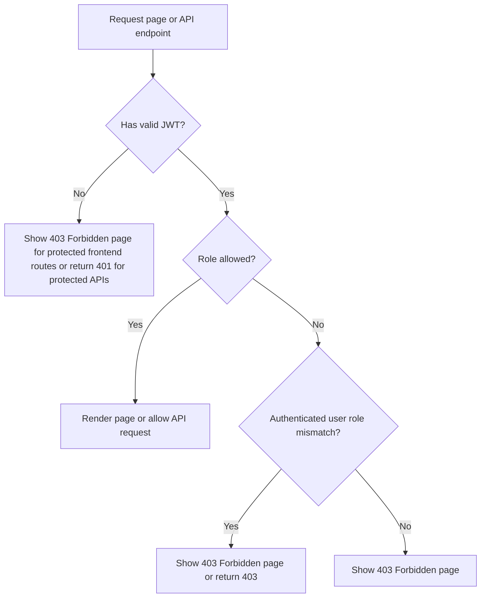

# RBAC

## Scope
This repository uses role-based access control at two layers:

- React route guards prevent users from entering pages they should not see.
- Laravel API middleware rejects unauthorized requests even if someone bypasses the UI.

## Roles
- Guest: not authenticated.
- User: authenticated account with `role = user`.
- Admin: authenticated account with `role = admin`.

## Permission Matrix

| Route / Action | Guest | User | Admin |
| --- | --- | --- | --- |
| `/` Home | Allowed | Allowed | Allowed |
| `/about` About Us | Allowed | Allowed | Allowed |
| `/login` | Allowed | Redirect to `/user-dashboard/items` or `/admin-dashboard/users` | Redirect to `/user-dashboard/items` or `/admin-dashboard/users` |
| `/register` | Allowed | Redirect to `/user-dashboard/items` or `/admin-dashboard/users` | Redirect to `/user-dashboard/items` or `/admin-dashboard/users` |
| `/user-dashboard/items` | 403 Forbidden | Allowed | 403 Forbidden |
| `/user-dashboard/activity` | 403 Forbidden | Allowed | 403 Forbidden |
| `/user-dashboard/notifications` | 403 Forbidden | Allowed | 403 Forbidden |
| `/user-dashboard/profile` | 403 Forbidden | Allowed | 403 Forbidden |
| `/admin-dashboard/users` | 403 Forbidden | 403 Forbidden | Allowed |
| `/admin-dashboard/reports` | 403 Forbidden | 403 Forbidden | Allowed |
| `/admin-dashboard/profile` | 403 Forbidden | 403 Forbidden | Allowed |
| `GET /api/items` | Allowed | Allowed | Allowed |
| `POST /api/items` | 401 Unauthorized | Allowed | 403 Forbidden |
| `PUT /api/items/{id}/claim` | 401 Unauthorized | Allowed | 403 Forbidden |
| `GET /api/my-activity` | 401 Unauthorized | Allowed | 403 Forbidden |
| `POST /api/claims/{claimId}/accept` | 401 Unauthorized | Allowed | 403 Forbidden |
| `POST /api/claims/{claimId}/decline` | 401 Unauthorized | Allowed | 403 Forbidden |
| `GET /api/users` | 401 Unauthorized | 403 Forbidden | Allowed |
| `GET /api/profile` | 401 Unauthorized | Allowed | Allowed |
| `POST /api/profile` | 401 Unauthorized | Allowed | Allowed |

## React `ProtectedRoute` Logic
The frontend route guard uses the JWT token stored in `localStorage` and reads the role from the JWT payload.

1. If the route is guest-only and the token is valid, redirect to the role landing page.
2. If the route requires a role and there is no valid token, show a 403 Forbidden state.
3. If the route requires a role and the token role does not match, show a 403 Forbidden state instead of treating it as authentication failure.
4. If the token is missing or expired, treat the user as a guest.

Landing pages:
- User: `/user-dashboard/items`
- Admin: `/admin-dashboard/users`

Forbidden page:
- `/forbidden`
- This page is rendered outside all layouts, so no navbar is shown.
- Message shown: `403 Forbidden` and `User does not have the access to this page.`

## Unauthorized Access Flow

## Notes
- About Us remains public and is accessible even after login.
- Login and registration are guest-only pages and immediately redirect when a valid authenticated session is detected.
- The backend now stores the role inside the JWT payload so the frontend can resolve the correct redirect target without guessing from UI state.
